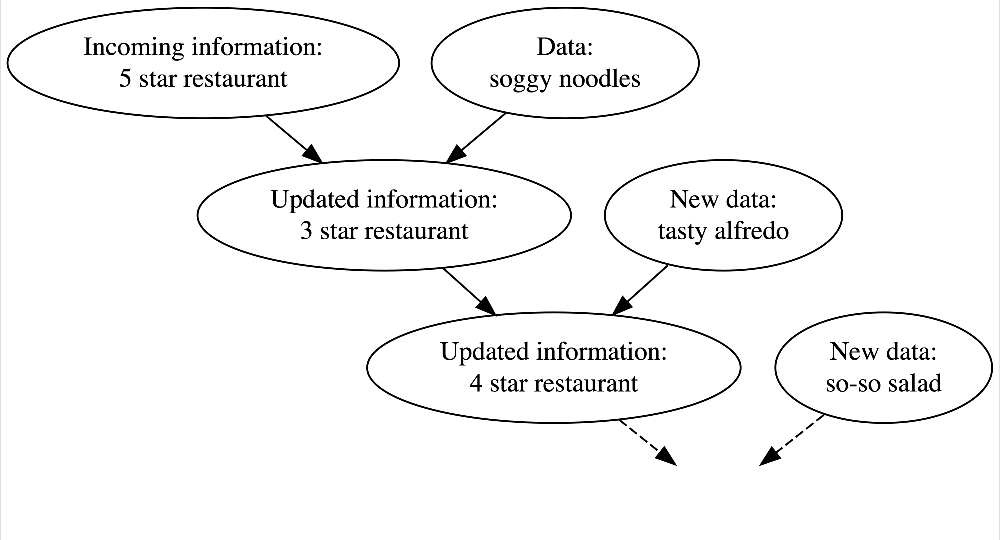
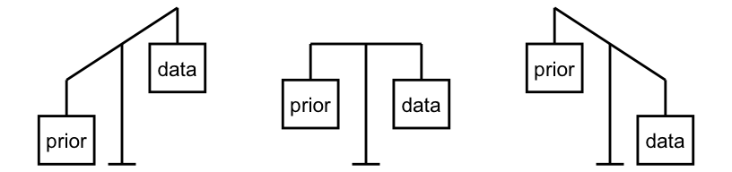
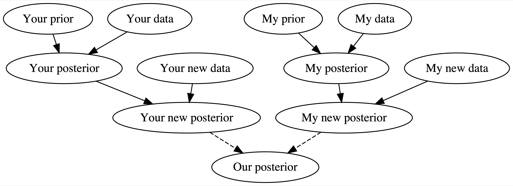
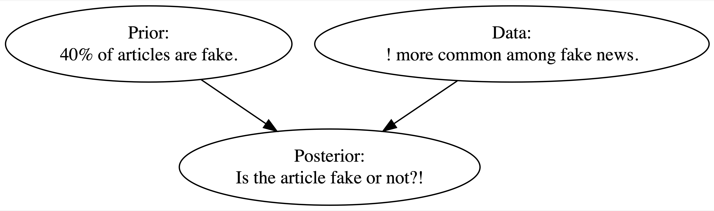
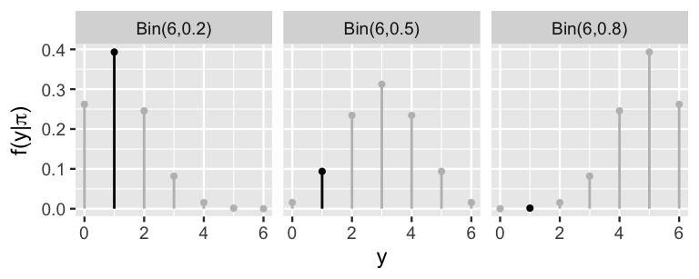

## Introduction

## Thinking Like a Bayesian

- Bayesian analysis involves updating beliefs based on observed data.

{fig-align="center"} 

## Thinking Like a Bayesian

- This is the natural Bayesian knowledge-building process of:
    - acknowledging your preconceptions (prior distribution),
    - using data (data distribution) to update your knowledge (posterior distribution), and 
    - repeating (posterior distribution $\to$ new prior distribution)

{fig-align="center"} 

## Thinking Like a Bayesian 

- Bayesian and frequentist analyses share a common goal: to learn from data about the world around us. 
    - Both Bayesian and frequentist analyses use data to fit models, make predictions, and evaluate hypotheses. 
    - When working with the same data, they will typically produce a similar set of conclusions. 
    
- Statisticians typically identify as either a "Bayesian" or "frequentist" ...
    - 🚫 We are not going to "take sides." 
    - ✅ We will see these as tools in our toolbox.

## Thinking Like a Bayesian
    
- Bayesian probability: the relative plausibility of an event.
    - Considers prior belief.

{fig-align="center"}     
    
## Thinking Like a Bayesian

- Frequentist probability: the long-run relative frequency of a repeatable event.
    - Does not consider prior belief.   
    
{fig-align="center"} 

## Thinking Like a Bayesian

- The Bayesian framework depends upon prior information, data, and the balance between them.

    - The balance between the prior information and data is determined by the relative strength of each

{fig-align="center"} 

- When we have little data, our posterior can rely more on prior knowledge. 

- As we collect more data, the prior can lose its influence.

## Thinking Like a Bayesian

- We can also use this approach to combine analysis results.

{fig-align="center"} 

## Thinking Like a Bayesian

- We will use an example to work through Bayesian logic.

- The Collins Dictionary named "fake news" the 2017 term of the year. 

    - Fake, misleading, and biased news has proliferated along with online news and social media platforms which allow users to post articles with little quality control. 
    
- We want to flag articles as "real" or "fake." 

- We'll examine a sample of 150 articles which were posted on Facebook and fact checked by five BuzzFeed journalists (Shu et al. 2017). 

## Thinking Like a Bayesian

- Information about each article is stored in the `fake_news` dataset in the `bayesrules` package. 

```{r}
fake_news <- bayesrules::fake_news
print(colnames(fake_news))
```

## Thinking Like a Bayesian

- We could build a simple news filter which uses the following rule: since most articles are real, we should read and believe all articles. 
    - While this filter would solve the problem of disregarding real articles, we would read lots of fake news. 
    - It also only takes into account the overall rates of, not the typical features of, real and fake news.

## Thinking Like a Bayesian

```{r}
#| echo: false
library(tidyverse)
library(janitor)
```

- Suppose that the most recent article posted to a social media platform is titled: *The president has a funny secret!*
    - Some features of this title probably set off some red flags. 
    - For example, the usage of an exclamation point might seem like an odd choice for a real news article. 

- In the dataset, what is the split of real and fake articles?

```{r}
#| echo: false
fake_news %>% tabyl(type)
```

## Thinking Like a Bayesian

- In the dataset, what is the split of real and fake articles?

```{r}
#| echo: false
fake_news %>% tabyl(type)
```

- Our data backs up our instinct on the article, 

```{r}
#| echo: false
fake_news %>% tabyl(title_has_excl, type) %>%
  adorn_percentages("col") %>%
  adorn_pct_formatting(digits = 2) %>%
  adorn_ns()
```
    
- In this dataset, 26.67% (16 of 60) of fake news titles but only 2.22% (2 of 90) of real news titles use an exclamation point.
    
## Thinking Like a Bayesian

- We now have two pieces of contradictory information. 
    - Our prior information suggested that incoming articles are most likely real. 
    - However, the exclamation point data is more consistent with fake news. 

{fig-align="center"} 

- Thinking like Bayesians, we know that balancing both pieces of information is important in developing a posterior understanding of whether the article is fake.

## Building a Bayesian Model

- Our fake news analysis studies two variables: 
    - an article's fake vs real status and 
    - its use of exclamation points. 
    
- We can represent the randomness in these variables using probability models. 

- We will now build: 
    - a prior probability model for our prior understanding of whether the most recent article is fake; 
    - a model for interpreting the exclamation point data; and, eventually, 
    - a posterior probability model which summarizes the posterior plausibility that the article is fake.

## Building a Bayesian Model

- Let's now formalize our prior understanding of whether the new article is fake. 

- Based on our `fake_news` data, we saw that 40% of articles are fake and 60% are real. 

    - Before reading the new article, there’s a 0.4 prior probability that it's fake and a 0.6 prior probability it's not.
    
$$P\left[B\right] = 0.40 \text{ and } P\left[B\right] = 0.40$$    

- Remember that a valid probability model must: 

    1. account for all possible events (all articles must be fake or real); 
    2. it assigns prior probabilities to each event; and 
    3. the probabilities sum to one.
    
## Building a Bayesian Model
    
- Now we will summarize the insights from the data we collected on the new article.
    - We want to formalize our observation that the exclamation point data is more compatible with fake news than with real news. 
    
```{r}
#| echo: false
library(gt)
fake_news %>% tabyl(title_has_excl, type) %>%
  adorn_percentages("col") %>%
  adorn_pct_formatting(digits = 1) %>%
  adorn_ns() %>%
  gt()
```       
    
- We have the following conditional probabilities:
    - If an article is fake ($B$), then there’s a roughly 26.67% chance it uses exclamation points in the title. 
    - If an article is real ($B^c$), then there’s only a roughly 2.22% chance it uses exclamation points. 
    
## Building a Bayesian Model

- We have the following conditional probabilities:
    - If an article is fake ($B$), then there’s a roughly 26.67% chance it uses exclamation points in the title. 
    - If an article is real ($B^c$), then there’s only a roughly 2.22% chance it uses exclamation points. 
    
- Looking at the probabilities, we can see that 26.67% of fake articles vs. 2.22% of real articles use exclamation points.
    - Exclamation point usage is much more likely among fake news than real news.
    - We have evidence that the article is fake.    
    
## Building a Bayesian Model

- Note that we know that the incoming article used exclamation points ($A$), but we do not actually know if the article is fake ($B$ or $B^c$).

- In this case, we compared $P[A|B]$ and $P[A|B^c]$ to ascertain the relative likelihood of observing $A$ under different scenarios.

$$L\left[B|A\right] = P\left[A|B\right] \text{ and } L\left[B^c|A\right] = P\left[A|B^c\right]$$

| Event | *B* | *B^c^* | Total |
|--|:--:|:--:|:--:|
| Prior Probability | 0.4 | 0.6 | 1.0 |
| Likelihood | 0.2667 | 0.0222 | 0.2889 |

- It is important for us to note that the likelihood function is *not* a probability function.
    - This is a framework to compare the relative comparability of our exclamation point data with $B$ and $B^c$.

## Building a Bayesian Model

| Event | *B* (fake) | *B^c^* (real) | Total |
|--|:--:|:--:|:--:|
| Prior Probability | 0.4 | 0.6 | 1.0 |
| Likelihood | 0.2667 | 0.0222 | 0.2889 |

- The prior evidence suggested the article is most likely real,

$$P[B] = 0.4 < P[B^c] = 0.6$$

- The data, however, is more consistent with the article being fake,

$$L[B|A] = 0.2667 > L[B^c|A] = 0.0222$$

## Building a Bayesian Model

- We can summarize our probabilities in a table, but some calculations are required.

- Here's what we know,

|           | $B$ | $B^c$ | Total |
|-----------|:---:|:-----:|:-----:|
| $A$       |     |       |       |
| $A^c$     |     |       |       |
| **Total** | 0.4 | 0.6   | 1     |

- We also know $P[A|B] = 0.2667$ and $P[A|B^c]=0.0222$.

- Thus,

$$
\begin{align*}
P[A \cap B] &= P[A|B] \times P[B] \\
&= 0.2667 \times 0.4 \\
&= 0.1067
\end{align*}
$$


## Building a Bayesian Model

- Here's what we know,

|           | $B$ | $B^c$ | Total |
|-----------|:---:|:-----:|:-----:|
| $A$       | 0.1067    |       |       |
| $A^c$     |     |       |       |
| **Total** | 0.4 | 0.6   | 1     |

- We also know $P[A|B] = 0.2667$ and $P[A|B^c]=0.0222$.

- Thus,

$$
\begin{align*}
P[A^c \cap B] &= P(A^c|B) \times P[B]  \\
&= (1-P[A|B]) \times P[B] \\
&= (1-0.2667) \times 0.4 \\
&= 0.2933
\end{align*}
$$

## Building a Bayesian Model

- Here's what we know,

|           | $B$ | $B^c$ | Total |
|-----------|:---:|:-----:|:-----:|
| $A$       | 0.1067 |       |       |
| $A^c$     | 0.2933 |       |       |
| **Total** | 0.4 | 0.6   | 1     |

- We also know $P[A|B] = 0.2667$ and $P[A|B^c]=0.0222$.

- Thus,

$$
\begin{align*}
P[A \cap B^c] &= P[A|B^c] \times P[B^c]  \\
&= 0.0222 \times 0.6 \\
&= 0.0133
\end{align*}
$$

## Building a Bayesian Model

- Here's what we know,

|           | $B$ | $B^c$ | Total |
|-----------|:---:|:-----:|:-----:|
| $A$       | 0.1067 | 0.0133 |       |
| $A^c$     | 0.2933 |       |       |
| **Total** | 0.4 | 0.6   | 1     |

- We also know $P[A|B] = 0.2667$ and $P[A|B^c]=0.0222$.

- Thus,

$$
\begin{align*}
P[A^c \cap B^c] &= P[A^c|B^c] \times P[B^c]  \\
&= 0.9778 \times 0.6 \\
&= 0.5867
\end{align*}
$$

## Building a Bayesian Model

- Here's what we know,

|           | $B$ | $B^c$ | Total |
|-----------|:---:|:-----:|:-----:|
| $A$       | 0.1067 | 0.0133 |       |
| $A^c$     | 0.2933 | 0.5867 |       |
| **Total** | 0.4 | 0.6   | 1     |

- Finally,

$$
\begin{align*}
&P[A] = 0.1067 + 0.0133 = 0.12 \\
&P[A^c] = 0.2933 + 0.5867 = 0.88
\end{align*}
$$

## Building a Bayesian Model

- Using rules of probability, we have completed the table.

|           | $B$ | $B^c$ | Total |
|-----------|:---:|:-----:|:-----:|
| $A$       | 0.1067 | 0.0133 | 0.12 |
| $A^c$     | 0.2933 | 0.5867 | 0.88 |
| **Total** | 0.4 | 0.6   | 1     |

## Building a Bayesian Model

- With more information, we can answer the question: what is the probability that the latest article is fake?

- We will use the posterior probability, $P[B|A]$, which is found using Bayes' Rule.

- **Bayes' Rule**: For events $A$ and $B$, 

$$P[B|A] = \frac{P[A \cap B]}{P[A]} = \frac{P[B] \times L[B|A]}{P[A]}$$

- But really, we can think about it like this,

$$\text{posterior} = \frac{\text{prior} \times \text{likelihood}}{\text{normalizing constant}}$$

## Example Set Up

- In 1996, Gary Kasparov played a six-game chess match against the IBM supercomputer Deep Blue. 
    - Of the six games, Kasparov won three, drew two, and lost one. 
    - Thus, Kasparov won the overall match. 

- Kasparov and Deep Blue were to meet again for a six-game match in 1997. 

- Let $\pi$ denote Kasparov's chances of winning any particular game in the re-match.
    - Thus, $\pi$ is a measure of his overall skill relative to Deep Blue. 
    - Given the complexity of chess, machines, and humans, $\pi$ is unknown and can vary over time.
        - i.e., $\pi$ is a *random variable*.

## Example Set Up

- Our first step is to start with a prior model. This model
    - Identifies what values $\pi$ can take,
    - assigns a prior weight or probability to each, and
    - these probabilities sum to 1.

- Based on what we were told, the prior model for $\pi$ in our example,

| $\pi$    | 0.2  | 0.5  | 0.8  | Total |
|----------|:----:|:----:|:----:|:----:|
| $f(\pi)$ | 0.10 | 0.25 | 0.65 | 1     |

- Note that this is an incredibly simple model.
    - The win probability can technically be any number $\in [0, 1]$.
    - However, this prior assumes that $\pi$ has a discrete set of possibilities: 20%, 50%, or 80%.

## Example Set Up

- In the second step of our analysis, we collect and process data which can inform our understanding of  $\pi$.
 
- Here, $Y$ = the number of the six games in the 1997 re-match that Kasparov wins.
    - As chess match outcome isn’t predetermined, $Y$ is a random variable that can take any value in $\{1, 2, 3, 4, 5, 6\}$.
    
- Note that $Y$ inherently depends upon $\pi$.
    - If $\pi = 0.80$, $Y$ would also be high (on average).
    - If $\pi = 0.20$, $Y$ would also be low (on average).
    
- Thus, we must model this dependence of $Y$ on $\pi$ using a conditional probability model.

## Binomial Data Model

- We must make two assumptions about the chess match:
    - Games are independent (the outcome of one game does not influence the outcome of another).
    - Kasparov has an equal probability of winning any game in the match.
        - i.e., probability of winning does not increase or decrease as the match goes on.

- We will use a binomial model for this problem.
    - In our case,

$$Y|\pi \sim \text{Bin}(6, \pi)$$

## Binomial Data Model

- Let's assume $\pi = 0.8$.

- The probability that he would win all 6 games is approximately 26%.

$$f(y=6|\pi=0.8) = {6 \choose 6} 0.8^6 (1-0.8)^{6-6}, $$  

```{r}
dbinom(6, 6, 0.8)
```

## Binomial Data Model

- Let's assume $\pi = 0.8$.

- The probability that he would win none of the games is approximately 0%.

$$f(y=0|\pi=0.8) = {6 \choose 0} 0.8^0 (1-0.8)^{6-0}, $$  

```{r}
dbinom(0, 6, 0.8)
```


## Binomial Data Model

- Your turn!

- We want to reproduce Figure 2.5 from the [Bayes Rules! textbook (from Section 2.3.2)](https://www.bayesrulesbook.com/chapter-2#cousin-cole).

{fig-align="center"} 

- Each group will complete the graph for a specified value of $\pi$.
    - Campus: $\pi=0.2$
    - Zoom 1: $\pi=0.5$
    - Zoom 2: $\pi=0.8$

## Binomial Data Model

- Note that the Binomial gives us the *theoretical* model of the data we might observe. 

    - Kasparov only won one of the six games against Deep Blue in 1997 ($Y=1$).
    
- Next step: how compatible this particular data is with the various possible $\pi$?

    - What is the likelihood of Kasparov winning $Y=1$ game under each possible $\pi$?
    
- Recall, $f(y|\pi) = L(\pi|Y=y)$. When $Y=1$,

$$
\begin{align*}
L(\pi | y = 1) &= f(y=1|\pi) \\
&= {6 \choose 1} \pi^1 (1-\pi)^6-1 \\
&= 6\pi(1-\pi)^5
\end{align*}
$$

- Note that <u>we do not expect all likelihoods to sum to 1</u>.
    
## Binomial Data Model

- Your turn! 

- Use your results from earlier to tell me the resulting likelihood values.

| $\pi$        | 0.2    | 0.5    | 0.8 |
|--------------|:------:|:------:|:----:|
| $L(\pi|y=1)$ | &nbsp; &nbsp; &nbsp; &nbsp; &nbsp;  | &nbsp; &nbsp; &nbsp; &nbsp; &nbsp;  | &nbsp; &nbsp; &nbsp; &nbsp; &nbsp; |

## Binomial Data Model

- Your turn! 

- Use your results from earlier to tell me the resulting likelihood values.
    
| $\pi$        | 0.2    | 0.5    | 0.8    |
|--------------|:------:|:------:|:----:|
| $L(\pi|y=1)$ | 0.3932 | 0.0938 | 0.0015 |

- As we can see, the likelihoods do not sum to 1.

## Normalizing Constant

- Bayes' Rule requires three pieces of information:
    - Prior
    - Likelihood
    - Normalizing constant
    
- **Normalizing constant**: ensures that the sum of all probabilities is equal to 1.
    - It can be a scalar or a function.
    - Every probability distribution that does not sum to 1 will have a normalizing constant.
    
## Normalizing Constant
    
- We now must determine the total probability that Kasparov would win $Y=1$ games across all possible win probabilities $\pi$, $f(y=1)$.

$$
\begin{align*}
f(y=1) =& \sum_{\pi} L(\pi |y=1)f(\pi) \\
=& L(\pi=0.2|y=1)f(\pi=0.2) + L(\pi=0.5|y=1)f(\pi=0.5) + \\ 
 & L(\pi=0.8|y=1)f(\pi=0.8) 
\end{align*}
$$

- Work with your group to find the normalizing constant.

## Normalizing Constant
    
- We now must determine the total probability that Kasparov would win $Y=1$ games across all possible win probabilities $\pi$, $f(y=1)$.

$$
\begin{align*}
f(y=1) =& \sum_{\pi} L(\pi |y=1)f(\pi) \\
=& L(\pi=0.2|y=1)f(\pi=0.2) + L(\pi=0.5|y=1)f(\pi=0.5) + \\ 
& L(\pi=0.8|y=1)f(\pi=0.8) \\
\approx& 0.3932 \cdot 0.10 + 0.0938 \cdot 0.25 + 0.0015 \cdot 0.65 \\
\approx& 0.0637
\end{align*}
$$

- Across all possible values of $\pi$, there is about a 6% chance that Kasparov would have won only one game.

## Posterior Probability Model

- Now recall,

$$\text{posterior} = \frac{\text{prior} \times \text{likelihood}}{\text{normalizing constant}}$$

- In our example, where $y = 1$,

$$f(\pi | y=1) = \frac{f(\pi) L(\pi | y = 1)}{f(y=1)} \  \text{for} \ \pi \in \{ 0.2, 0.5, 0.8\}$$

- Work with your group to find the posterior probabilities.

    - You will have one posterior probability for each value of $\pi$.

## Posterior Probability Model

- Note!! We do not have to calculate the normalizing constant!

- We can note that $f(Y=y) = 1/c$.

- Then, we say that 

$$
\begin{align*}
f(\pi | y) &= \frac{f(\pi) L(\pi|y)}{f(y)} \\
& \propto  f(\pi) L(\pi|y) \\
\\
\text{posterior} &\propto \text{prior} \cdot \text{likelihood}
\end{align*}
$$

## Example Set Up

- Consider the following scenario. 
    - "Michelle" has decided to run for president and you're her campaign manager for the state of Florida. 
    - As such, you've conducted 30 different polls throughout the election season. 
    - Though Michelle's support has hovered around 45%, she polled at around 35% in the dreariest days and around 55% in the best days on the campaign trail.
    
<center></center>  

## Example Set Up

- Past polls provide prior information about $\pi$, the proportion of Floridians that currently support Michelle. 

    - In fact, we can reorganize this information into a formal prior probability model of $\pi$.

- In a previous problem, we assumed that $\pi$ could only be 0.2, 0.5, or 0.8, the corresponding chances of which were defined by a discrete probability model.

    - However, in the reality of Michelle's election support, $\pi \in [0, 1]$. 
    
- We can reflect this reality and conduct a Bayesian analysis by constructing a continuous prior probability model of $\pi$.

## Example Set Up

<center></center>  

- A reasonable prior is represented by the curve on the right. 

    - Notice that this curve preserves the overall information and variability in the past polls, i.e., Michelle's support, $\pi$ can be anywhere between 0 and 1, but is most likely around 0.45.

## Example Set Up

- Incorporating this more nuanced, continuous view of Michelle's support, $\pi$, will require some new tools. 
    - No matter if our parameter $\pi$ is continuous or discrete, the posterior model of $\pi$ will combine insights from the prior and data. 
    - $\pi$ isn’t the only variable of interest that lives on [0,1]. 
    
- Maybe we're interested in modeling the proportion of people that use public transit, the proportion of trains that are delayed, the proportion of people that prefer cats to dogs, etc. 
    - The Beta-Binomial model provides the tools we need to study the proportion of interest, $\pi$, in each of these settings.    
    
## Beta Prior

<center></center>  

- In building the Bayesian election model of Michelle's election support among Floridians, $\pi$, we begin with the prior. 

    - Our continuous prior probability model of $\pi$ is specified by the probability density function (pdf). 
    
- What values can $\pi$ take and which are more plausible than others?

## Beta Prior

- Let $\pi$ be a random variable, where $\pi \in [0, 1]$. 

- The variability in $\pi$ may be captured by a Beta model with shape hyperparameters $\alpha > 0$ and $\beta > 0$,

    - **hyperparameter:** a parameter used in a prior model.
    
$$ \pi \sim \text{Beta}(\alpha, \beta), $$

- Let's explore the shape of the Beta:

```{r}
#| eval: false

library(bayesrules)
library(tidyverse)

plot_beta(1, 5) + theme_bw()
plot_beta(1, 2) + theme_bw()
plot_beta(3, 7) + theme_bw()
plot_beta(1, 1) + theme_bw()
```

## Beta Prior

<center>
```{r}
#| echo: false
library(bayesrules)
library(tidyverse)
```
```{r}
plot_beta(1, 5) + theme_bw() + ggtitle("Beta(1, 5)")
```
</center>

## Beta Prior

<center>
```{r}
plot_beta(1, 2) + theme_bw() + ggtitle("Beta(1, 2)")
```
</center>

## Beta Prior

<center>
```{r}
plot_beta(3, 7) + theme_bw() + ggtitle("Beta(3, 7)")
```
</center>

## Beta Prior

<center>
```{r}
plot_beta(1, 1) + theme_bw() + ggtitle("Beta(1, 1)")
```
</center>

## Beta Prior

- Your turn!

- How would you describe the typical behavior of a:
    - Beta($\alpha, \beta$) variable, $\pi$, when $\alpha=\beta$?
    - Beta($\alpha, \beta$) variable, $\pi$, when $\alpha>\beta$?
    - Beta($\alpha, \beta$) variable, $\pi$, when $\alpha<\beta$?
    
- For which model is there greater variability in the plausible values of $\pi$, Beta(20, 20) or Beta(5, 5)?

## Tuning the Beta Prior

- We can *tune* the shape hyperparameters ($\alpha$ and $\beta$) to reflect our prior information about Michelle's election support, $\pi$.

- In our example, we saw that she polled between 25 and 65 percentage points, with an average of 45 percentage points.
    - We want our Beta($\alpha, \beta$) to have similar patterns.
    - We want to pick $\alpha$ and $\beta$ such that $\pi$ is around 0.45.
    
$$
E[\pi] = \frac{\alpha}{\alpha+\beta} \approx 0.45
$$

- Using algebra, we can tune, and find

$$\alpha \approx \frac{9}{11} \beta$$

## Tuning the Beta Prior

- Your turn!

    - Graph the following and determine which is best for the example.
        
```{r}
#| eval: false

plot_beta(9, 11) + theme_bw()
plot_beta(27, 33) + theme_bw()
plot_beta(45, 55) + theme_bw()
```        
        
- Recall, this is what we are going for:        

<center></center>  

## Tuning the Beta Prior

<center>
```{r}
plot_beta(9, 11) + theme_bw() + ggtitle("Beta(9, 11)")
```
</center>

## Tuning the Beta Prior

<center>
```{r}
plot_beta(27, 33) + theme_bw() + ggtitle("Beta(27, 33)")
```
</center>

## Tuning the Beta Prior

<center>
```{r}
plot_beta(45, 55) + theme_bw() + ggtitle("Beta(45, 55)")
```
</center>

## Tuning the Beta Prior

- Now that we have a prior, we "know" some things.

$$\pi \sim \text{Beta}(45, 55)$$

- From the properties of the beta distribution,

$$
\begin{equation*}
\begin{aligned}
E[\pi] &= \frac{\alpha}{\alpha + \beta} & \text{ and } & \text{ } & \text{ }  \\
&=\frac{45}{45+55} \\
&= 0.45
\end{aligned} 
\begin{aligned}
\text{var}[\pi] &= \frac{\alpha\beta}{(\alpha+\beta)^2(\alpha+\beta+1)} \\
&= \frac{(45)(55)}{(45+55)^2(45+55+1)} \\
&= 0.0025
\end{aligned}
\end{equation*}
$$


## The Binomial Data Model and Likelihood Function
        
- Now we are ready to think about the data collection.

- A new poll of $n = 50$ Floridians recorded $Y$, the number that support Michelle. 

    - The results depend upon $\pi$ -- the greater Michelle’s actual support, the greater $Y$ will tend to be. 
    
- To model the dependence of $Y$ on $\pi$, we assume

    - voters answer the poll independently of one another;
    - the probability that any polled voter supports your candidate Michelle is $\pi$
    
- This is a binomial event, $Y|\pi \sim \text{Bin}(50, \pi)$,  with conditional pmf, $f(y|\pi)$ defined for $y \in \{0, 1, ..., 50\}$

$$f(y|\pi) = P[Y = y|\pi] = {50 \choose y} \pi^y (1-\pi)^{50-y}$$

## The Binomial Data Model and Likelihood Function

- The conditional pmf, $f(y|\pi)$, gives us answers to a hypothetical question:

    - If Michelle's support were given some value of $\pi$, then how many of the 50 polled voters ($Y=y$) might we expect to suppport her?

- Let's look at this graphically:

```{r}
#| eval: false

n <- 50
pi <- value of pi

binom_prob <- tibble(n_success = 1:n,
                     prob = dbinom(n_success, size=n, prob=pi))

binom_prob %>%
  ggplot(aes(x=n_success,y=prob))+
  geom_col(width=0.2)+
  labs(x= "Number of Successes",
       y= "Probability") +
  theme_bw()
```

## The Binomial Data Model and Likelihood Function

```{r}
#| echo: false
library(latex2exp)
library(tidyverse)
```

<center>
```{r}
#| echo: false

n <- 50
pi <- 0.1

binom_prob <- tibble(n_success = 1:n) %>%
  mutate(prob = dbinom(n_success, size=n, prob=pi))
binom_prob %>%
  ggplot(aes(x=n_success,y=prob))+
  geom_col(width=0.2)+
  labs(x= "Number of Successes",
       y= "Probability", 
       title = TeX(r'($\pi=0.1$)')) +
  theme_bw()
```
</center>


## The Binomial Data Model and Likelihood Function

<center>
```{r}
#| echo: false

n <- 50
pi <- 0.5

binom_prob <- tibble(n_success = 1:n) %>%
  mutate(prob = dbinom(n_success, size=n, prob=pi))
binom_prob %>%
  ggplot(aes(x=n_success,y=prob))+
  geom_col(width=0.2)+
  labs(x= "Number of Successes",
       y= "Probability",
       title = TeX(r'($\pi=0.5$)')) +
  theme_bw()
```
</center>


## The Binomial Data Model and Likelihood Function

<center>
```{r}
#| echo: false

n <- 50
pi <- 0.75

binom_prob <- tibble(n_success = 1:n) %>%
  mutate(prob = dbinom(n_success, size=n, prob=pi))
binom_prob %>%
  ggplot(aes(x=n_success,y=prob))+
  geom_col(width=0.2)+
  labs(x= "Number of Successes",
       y= "Probability",
       title = TeX(r'($\pi=0.75$)')) +
  theme_bw()
```
</center>

## The Binomial Data Model and Likelihood Function

- It is observed that $Y=30$ of the $n=50$ polled voters support Michelle.

- We now want to find the likelihood function -- remember that we treat $Y=30$ as the observed data and $\pi$ as unknown,

$$
\begin{align*}
f(y|\pi) &= {50 \choose y} \pi^y (1-\pi)^{50-y} \\
L(\pi|y=30) &= {50 \choose 30} \pi^{30} (1-\pi)^{20}
\end{align*}
$$

- This is valid for $\pi \in [0, 1]$.

## The Binomial Data Model and Likelihood Function

- What is the likelihood of 30/50 voters supporting Michelle?

```{r}
#| eval: false
dbinom(30, 50, pi)
```

- You try this for $\pi = \{0.25, 0.50, 0.75\}$.

## The Binomial Data Model and Likelihood Function

- What is the likelihood of 30/50 voters supporting Michelle?

```{r}
#| eval: false
dbinom(30, 50, pi)
```

- You try this for $\pi = \{0.25, 0.50, 0.75\}$.

```{r}
#| eval: false
dbinom(30, 50, 0.25)
dbinom(30, 50, 0.5)
dbinom(30, 50, 0.75)
```

## The Binomial Data Model and Likelihood Function

- What is the likelihood of 30/50 voters supporting Michelle?

```{r}
dbinom(30, 50, 0.25)
dbinom(30, 50, 0.5)
dbinom(30, 50, 0.75)
```

## The Binomial Data Model and Likelihood Function

- Challenge!

- Create a graph showing what happens to the likelihood for different values of $\pi$.

    - i.e., have $\pi$ on the $x$-axis and likelihood on the $y$-axis.
    
- To get you started,    
    
```{r}
#| eval: false
graph <- tibble(pi = seq(0, 1, 0.001)) %>%
  mutate(likelihood = dbinom(30, 50, pi))
```    
    
## The Binomial Data Model and Likelihood Function

- Create a graph showing what happens to the likelihood for different values of $\pi$.

<center>
```{r}
#| echo: false
graph <- tibble(pi = seq(0, 1, 0.001)) %>%
  mutate(likelihood = dbinom(30, 50, pi))

graph %>% ggplot(aes(x = pi, y = likelihood)) +
  geom_line() +
  labs(x = "Probability of Success", y = "Likelihood") +
  theme_bw()
```
</center>

- Where is the maximum?

## The Binomial Data Model and Likelihood Function

- Where is the maximum?

<center>
```{r}
#| echo: false
graph <- tibble(pi = seq(0, 1, 0.001)) %>%
  mutate(likelihood = dbinom(30, 50, pi))
  
graph2 <- graph %>% filter(likelihood == max(likelihood))

graph %>% ggplot(aes(x = pi, y = likelihood)) +
  geom_line() +
  geom_point(data = graph2, color = "red", size = 3) +
  geom_text(data = graph2, label =  TeX(r'($\pi=0.60$)'), hjust=-.5) +
  labs(x = "Probability of Success", y = "Likelihood") +
  theme_bw()
```
</center>

## The Beta Posterior Model

$$
\begin{align*}
Y|\pi &\sim \text{Bin}(50, \pi) \\
\pi &\sim \text{Beta}(45, 55)
\end{align*}
$$

<center>
```{r}
#| echo: false
plot_beta_binomial(alpha = 45, beta = 55, y = 30, n = 50, posterior = FALSE) + 
  theme_bw()
```
</center>

- The prior is a bit more pessimistic about Michelle's election support than the data obtained from the latest poll.

## The Beta Posterior Model

- Let's graph the posterior,

<center>
```{r}
plot_beta_binomial(alpha = 45, beta = 55, y = 30, n = 50) + theme_bw()
```
</center>

- We can see that the posterior model of $\pi$ is continuous and $\in [0, 1]$.

- The shape of the posterior appears to also have a Beta($\alpha$, $\beta$) model.

    - The shape parameters ($\alpha$ and $\beta$) have been *updated*.

## The Beta Posterior Model
    
- If we were to collect more information about Michelle's support, we would use the current posterior as the new prior, then update our posterior. 

    - How do we know what the updated parameters are?

```{r}
summarize_beta_binomial(alpha = 45, beta = 55, y = 30, n = 50)
```

## The Beta Posterior Model

- We used Michelle's election support to understand the Beta-Binomial model.

- Let's now generalize it for any appropriate situation.

$$
\begin{align*}
Y|\pi &\sim \text{Bin}(n, \pi) \\
\pi &\sim \text{Beta}(\alpha, \beta) \\
\pi | (Y=y) &\sim \text{Beta}(\alpha+y, \beta+n-y)
\end{align*}
$$

- We can see that the posterior distribution reveals the influence of the prior ($\alpha$ and $\beta$) and data ($y$ and $n$).

## The Beta Posterior Model

- Under this updated distribution,

$$
\pi | (Y=y) \sim \text{Beta}(\alpha+y, \beta+n-y)
$$

- we have updated moments:

$$
\begin{align*}
E[\pi | Y = y] &= \frac{\alpha + y}{\alpha + \beta + n} \\
\text{Var}[\pi|Y=y] &= \frac{(\alpha+y)(\beta+n-y)}{(\alpha+\beta+n)^2(\alpha+\beta+1)}
\end{align*}
$$

## The Beta Posterior Model

- Let's pause and think about this from a theoretical standpoint.

- The Beta distribution is a *conjugate prior* for the likelihood.

    - **Conjugate prior**: the posterior is from the same model family as the prior.
    
- Recall the Beta prior, $f(\pi)$, 

$$ L(\pi|y) = {n \choose y} \pi^y (1-\pi)^{n-y} $$

- and the likelihood function, $L(\pi|y)$.

$$ f(\pi) = \frac{\Gamma(\alpha+\beta)}{\Gamma(\alpha)\Gamma(\beta)} \pi^{\alpha-1}(1-\alpha)^{\beta-1} $$

## The Beta Posterior Model

- We can put the prior and likelihood together to create the posterior,

$$
\begin{align*}
f(\pi|y) &\propto f(\pi)L(\pi|y) \\
&= \frac{\Gamma(\alpha+\beta)}{\Gamma(\alpha)\Gamma(\beta)} \pi^{\alpha-1}(1-\pi)^{\beta-1} \times {n \choose y} \pi^y (1-\pi)^{n-1} \\
&\propto \pi^{(\alpha+y)-1} (1-\pi)^{(\beta+n-y)-1}
\end{align*}
$$

- This is the same structure as the normalized Beta($\alpha+y, \beta+n-y$),

$$f(\pi|y) = \frac{\Gamma(\alpha+\beta+n)}{\Gamma(\alpha+y) \Gamma(\beta+n-y)} \pi^{(\alpha+y)-1} (1-\pi)^{(\beta+n-y)-1}$$

## Example Set Up

- In a 1963 issue of The Journal of Abnormal and Social Psychology, Stanley Milgram described a study in which he investigated the propensity of people to obey orders from authority figures, even when those orders may harm other people ([Milgram 1963](https://psycnet.apa.org/record/1964-03472-001?doi=1)).

- Study participants were given the task of testing another participant (who was a trained actor) on their ability to memorize facts. 

- If the actor didn't remember a fact, the participant was ordered to administer a shock on the actor and to increase the shock level with every subsequent failure. 

- Unbeknownst to the participant, the shocks were fake and the actor was only pretending to register pain from the shock.

## Example Set Up

- The parameter of interest here is $\pi$, the chance that a person would obey authority (in this case, administering the most severe shock), even if it meant bringing harm to others. 
    - Since Milgram passed away in 1984, we don’t have the opportunity to ask him about his understanding of $\pi$ prior to conducting the study.
    - Suppose another psychologist helped carry out this work. Prior to collecting data, they indicated that a Beta(1,10) model accurately reflected their understanding about $\pi$.

- The outcome of interest is $Y$, the number of the $n=40$ study participants that would inflict the most severe shock. 

- What model is appropriate?

## Example

- What model is appropriate?

- Assuming that each participant behaves independently of the others, we can model the dependence of $Y$ on $\pi$ using the Binomial.

- Thus, we have a Beta-Binomial Bayesian model.

$$
\begin{align*}
Y|\pi &\sim \text{Bin}(40, \pi) \\
\pi &\sim \text{Beta}(1, 10)
\end{align*}
$$

## Example

- What do you think this prior reveals about the psychologist's prior understanding of $\pi$?

```{r}
#| eval: false
plot_beta(alpha = 1, beta = 10)
```

a. They don't have an informed opinion.

b. They're fairly certain that a large proportion of people will do what authority tells them.

c. They're fairly certain that only a small proportion of people will do what authority tells them.

## Example

- What do you think this prior reveals about the psychologist's prior understanding of $\pi$?

<center>
```{r}
#| echo: false
plot_beta(alpha = 1, beta = 10) + theme_bw()
```
</center>

**c. They're fairly certain that only a small proportion of people will do what authority tells them.**

## Example

- After data collection, $Y = 26$ of the $n=40$ study participants inflected what they understood to be the maximum shock. 

- From the problem set up,

$$
\begin{align*}
Y|\pi &\sim \text{Bin}(40, \pi) \\
\pi &\sim \text{Beta}(1, 10)
\end{align*}
$$

- Use what you know to find the posterior model of $\pi$,

$$\pi|(Y=26) \sim \text{Beta}(\text{??}, \text{??})$$

## Example

- After data collection, $Y = 26$ of the $n=40$ study participants inflected what they understood to be the maximum shock. 

- Use what you know to find the posterior model of $\pi$,

$$\pi|(Y=26) \sim \text{Beta}(\text{??}, \text{??})$$

- With $\alpha = 1$ and $\beta = 10$, we know the posterior distribution will be as follows,

$$
\begin{align*}
\pi | (Y=y) &\sim \text{Beta}(\alpha+y, \beta+n-y) \\
&\sim \text{Beta}(1+26, 10+40-26) \\
&\sim \text{Beta}(27, 24)
\end{align*}
$$

## Example

- Let's find the summary,

```{r}
#| eval: false
summarize_beta_binomial(alpha = 1, beta = 10, y = 26, n = 40)
```

- and graph the distributions involved,

```{r}
#| eval: false
plot_beta_binomial(alpha = 1, beta = 10, y = 26, n = 40)
```

- What belief did we have for $\pi$ before considering the data?

- What belief do we have for $\pi$ after considering the prior and the observed data?

## Example

- Let's find the summary,

```{r}
summarize_beta_binomial(alpha = 1, beta = 10, y = 26, n = 40)
```

## Example

- Let's graph the distributions involved,

<center>
```{r}
plot_beta_binomial(alpha = 1, beta = 10, y = 26, n = 40) + theme_bw()
```
</center>

## Example

<center>
```{r}
#| echo: false
#| fig-width: 6
#| fig-height: 4
plot_beta_binomial(alpha = 1, beta = 10, y = 26, n = 40) + theme_bw()
```
</center>

- What belief did we have for $\pi$ before considering the data?

    - Fewer than 25% of people would inflict the most severe shock.

- What belief do we have for $\pi$ after considering the prior and the observed data?

    - Somewhere between 30% and 70% of people would inflict the most severe shock.

## Wrap Up: Beta-Binomial

- We have built the Beta-Binomial model for $\pi$, an unknown proportion.

$$
\begin{equation*}
\begin{aligned}
Y|\pi &\sim \text{Bin}(n,\pi) \\
\pi &\sim \text{Beta}(\alpha,\beta) &
\end{aligned} 
\Rightarrow 
\begin{aligned}
&& \pi | (Y=y) &\sim \text{Beta}(\alpha+y, \beta+n-y) \\
\end{aligned}
\end{equation*}
$$

- The prior model, $f(\pi)$, is given by Beta($\alpha,\beta$).

- The data model, $f(Y|\pi)$, is given by Bin($n,\pi$).

- The likelihood function, $L(\pi|y)$, is obtained by plugging $y$ into the Binomial pmf.

- The posterior model is a Beta distribution with updated parameters $\alpha+y$ and $\beta+n-y$.

## Homework

- 1.3
- 1.4
- 1.8
- 2.4
- 2.9
- 3.3
- 3.9
- 3.10
- 3.18
