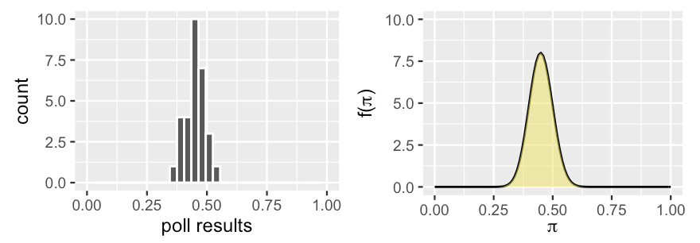

## Introduction

## Example Set Up

- Consider the following scenario. 
    - "Michelle" has decided to run for president and you're her campaign manager for the state of Florida. 
    - As such, you've conducted 30 different polls throughout the election season. 
    - Though Michelle's support has hovered around 45%, she polled at around 35% in the dreariest days and around 55% in the best days on the campaign trail.
    
<center></center>  

## Example Set Up

- Past polls provide prior information about $\pi$, the proportion of Floridians that currently support Michelle. 

    - In fact, we can reorganize this information into a formal prior probability model of $\pi$.

- In a previous problem, we assumed that $\pi$ could only be 0.2, 0.5, or 0.8, the corresponding chances of which were defined by a discrete probability model.

    - However, in the reality of Michelle's election support, $\pi \in [0, 1]$. 
    
- We can reflect this reality and conduct a Bayesian analysis by constructing a continuous prior probability model of $\pi$.

## Example Set Up

<center></center>  

- A reasonable prior is represented by the curve on the right. 

    - Notice that this curve preserves the overall information and variability in the past polls, i.e., Michelle's support, $\pi$ can be anywhere between 0 and 1, but is most likely around 0.45.

## Example Set Up

- Incorporating this more nuanced, continuous view of Michelle's support, $\pi$, will require some new tools. 
    - No matter if our parameter $\pi$ is continuous or discrete, the posterior model of $\pi$ will combine insights from the prior and data. 
    - $\pi$ isn’t the only variable of interest that lives on [0,1]. 
    
- Maybe we're interested in modeling the proportion of people that use public transit, the proportion of trains that are delayed, the proportion of people that prefer cats to dogs, etc. 
    - The Beta-Binomial model provides the tools we need to study the proportion of interest, $\pi$, in each of these settings.    
    
## Beta Prior

<center></center>  

- In building the Bayesian election model of Michelle's election support among Floridians, $\pi$, we begin with the prior. 

    - Our continuous prior probability model of $\pi$ is specified by the probability density function (pdf). 
    
- What values can $\pi$ take and which are more plausible than others?

## Beta Prior

- Let $\pi$ be a random variable, where $\pi \in [0, 1]$. 

- The variability in $\pi$ may be captured by a Beta model with shape hyperparameters $\alpha > 0$ and $\beta > 0$,

    - **hyperparameter:** a parameter used in a prior model.
    
$$ \pi \sim \text{Beta}(\alpha, \beta), $$

- Let's explore the shape of the Beta:

```{r}
#| eval: false

library(bayesrules)
library(tidyverse)

plot_beta(1, 5) + theme_bw()
plot_beta(1, 2) + theme_bw()
plot_beta(3, 7) + theme_bw()
plot_beta(1, 1) + theme_bw()
```

## Beta Prior

<center>
```{r}
#| echo: false
library(bayesrules)
library(tidyverse)
```
```{r}
plot_beta(1, 5) + theme_bw() + ggtitle("Beta(1, 5)")
```
</center>

## Beta Prior

<center>
```{r}
plot_beta(1, 2) + theme_bw() + ggtitle("Beta(1, 2)")
```
</center>

## Beta Prior

<center>
```{r}
plot_beta(3, 7) + theme_bw() + ggtitle("Beta(3, 7)")
```
</center>

## Beta Prior

<center>
```{r}
plot_beta(1, 1) + theme_bw() + ggtitle("Beta(1, 1)")
```
</center>

## Beta Prior

- Your turn!

- How would you describe the typical behavior of a:
    - Beta($\alpha, \beta$) variable, $\pi$, when $\alpha=\beta$?
    - Beta($\alpha, \beta$) variable, $\pi$, when $\alpha>\beta$?
    - Beta($\alpha, \beta$) variable, $\pi$, when $\alpha<\beta$?
    
- For which model is there greater variability in the plausible values of $\pi$, Beta(20, 20) or Beta(5, 5)?

## Tuning the Beta Prior

- We can *tune* the shape hyperparameters ($\alpha$ and $\beta$) to reflect our prior information about Michelle's election support, $\pi$.

- In our example, we saw that she polled between 25 and 65 percentage points, with an average of 45 percentage points.
    - We want our Beta($\alpha, \beta$) to have similar patterns.
    - We want to pick $\alpha$ and $\beta$ such that $\pi$ is around 0.45.
    
$$
E[\pi] = \frac{\alpha}{\alpha+\beta} \approx 0.45
$$

- Using algebra, we can tune, and find

$$\alpha \approx \frac{9}{11} \beta$$

## Tuning the Beta Prior

- Your turn!

    - Graph the following and determine which is best for the example.
        
```{r}
#| eval: false

plot_beta(9, 11) + theme_bw()
plot_beta(27, 33) + theme_bw()
plot_beta(45, 55) + theme_bw()
```        
        
- Recall, this is what we are going for:        

<center></center>  

## Tuning the Beta Prior

<center>
```{r}
plot_beta(9, 11) + theme_bw() + ggtitle("Beta(9, 11)")
```
</center>

## Tuning the Beta Prior

<center>
```{r}
plot_beta(27, 33) + theme_bw() + ggtitle("Beta(27, 33)")
```
</center>

## Tuning the Beta Prior

<center>
```{r}
plot_beta(45, 55) + theme_bw() + ggtitle("Beta(45, 55)")
```
</center>

## Tuning the Beta Prior

- Now that we have a prior, we "know" some things.

$$\pi \sim \text{Beta}(45, 55)$$

- From the properties of the beta distribution,

$$
\begin{equation*}
\begin{aligned}
E[\pi] &= \frac{\alpha}{\alpha + \beta} & \text{ and } & \text{ } & \text{ }  \\
&=\frac{45}{45+55} \\
&= 0.45
\end{aligned} 
\begin{aligned}
\text{var}[\pi] &= \frac{\alpha\beta}{(\alpha+\beta)^2(\alpha+\beta+1)} \\
&= \frac{(45)(55)}{(45+55)^2(45+55+1)} \\
&= 0.0025
\end{aligned}
\end{equation*}
$$


## Binomial Data Model
        
- Now we are ready to think about the data collection.

- A new poll of $n = 50$ Floridians recorded $Y$, the number that support Michelle. 

    - The results depend upon $\pi$ -- the greater Michelle’s actual support, the greater $Y$ will tend to be. 
    
- To model the dependence of $Y$ on $\pi$, we assume

    - voters answer the poll independently of one another;
    - the probability that any polled voter supports your candidate Michelle is $\pi$
    
- This is a binomial event, $Y|\pi \sim \text{Bin}(50, \pi)$,  with conditional pmf, $f(y|\pi)$ defined for $y \in \{0, 1, ..., 50\}$

$$f(y|\pi) = P[Y = y|\pi] = {50 \choose y} \pi^y (1-\pi)^{50-y}$$

## Binomial Data Model

- The conditional pmf, $f(y|\pi)$, gives us answers to a hypothetical question:

    - If Michelle's support were given some value of $\pi$, then how many of the 50 polled voters ($Y=y$) might we expect to suppport her?

- Let's look at this graphically:

```{r}
#| eval: false

n <- 50
pi <- value of pi

binom_prob <- tibble(n_success = 1:n,
                     prob = dbinom(n_success, size=n, prob=pi))

binom_prob %>%
  ggplot(aes(x=n_success,y=prob))+
  geom_col(width=0.2)+
  labs(x= "Number of Successes",
       y= "Probability") +
  theme_bw()
```

## Binomial Data Model

```{r}
#| echo: false
library(latex2exp)
library(tidyverse)
```

<center>
```{r}
#| echo: false

n <- 50
pi <- 0.1

binom_prob <- tibble(n_success = 1:n) %>%
  mutate(prob = dbinom(n_success, size=n, prob=pi))
binom_prob %>%
  ggplot(aes(x=n_success,y=prob))+
  geom_col(width=0.2)+
  labs(x= "Number of Successes",
       y= "Probability", 
       title = TeX(r'($\pi=0.1$)')) +
  theme_bw()
```
</center>


## Binomial Data Model

<center>
```{r}
#| echo: false

n <- 50
pi <- 0.5

binom_prob <- tibble(n_success = 1:n) %>%
  mutate(prob = dbinom(n_success, size=n, prob=pi))
binom_prob %>%
  ggplot(aes(x=n_success,y=prob))+
  geom_col(width=0.2)+
  labs(x= "Number of Successes",
       y= "Probability",
       title = TeX(r'($\pi=0.5$)')) +
  theme_bw()
```
</center>


## Binomial Data Model

<center>
```{r}
#| echo: false

n <- 50
pi <- 0.75

binom_prob <- tibble(n_success = 1:n) %>%
  mutate(prob = dbinom(n_success, size=n, prob=pi))
binom_prob %>%
  ggplot(aes(x=n_success,y=prob))+
  geom_col(width=0.2)+
  labs(x= "Number of Successes",
       y= "Probability",
       title = TeX(r'($\pi=0.75$)')) +
  theme_bw()
```
</center>

## Binomial Data Model

- It is observed that $Y=30$ of the $n=50$ polled voters support Michelle.

- We now want to find the likelihood function -- remember that we treat $Y=30$ as the observed data and $\pi$ as unknown,

$$
\begin{align*}
f(y|\pi) &= {50 \choose y} \pi^y (1-\pi)^{50-y} \\
L(\pi|y=30) &= {50 \choose 30} \pi^{30} (1-\pi)^{20}
\end{align*}
$$

- This is valid for $\pi \in [0, 1]$.

## Binomial Data Model

- What is the likelihood of 30/50 voters supporting Michelle?

```{r}
#| eval: false
dbinom(30, 50, pi)
```

- You try this for $\pi = \{0.25, 0.50, 0.75\}$.

## Binomial Data Model

- What is the likelihood of 30/50 voters supporting Michelle?

```{r}
#| eval: false
dbinom(30, 50, pi)
```

- You try this for $\pi = \{0.25, 0.50, 0.75\}$.

```{r}
#| eval: false
dbinom(30, 50, 0.25)
dbinom(30, 50, 0.5)
dbinom(30, 50, 0.75)
```

## Binomial Data Model

- What is the likelihood of 30/50 voters supporting Michelle?

```{r}
dbinom(30, 50, 0.25)
dbinom(30, 50, 0.5)
dbinom(30, 50, 0.75)
```

## Binomial Data Model

- Challenge!

- Create a graph showing what happens to the likelihood for different values of $\pi$.

    - i.e., have $\pi$ on the $x$-axis and likelihood on the $y$-axis.
    
- To get you started,    
    
```{r}
#| eval: false
graph <- tibble(pi = seq(0, 1, 0.001)) %>%
  mutate(likelihood = dbinom(30, 50, pi))
```    
    
## Binomial Data Model

- Create a graph showing what happens to the likelihood for different values of $\pi$.

<center>
```{r}
#| echo: false
graph <- tibble(pi = seq(0, 1, 0.001)) %>%
  mutate(likelihood = dbinom(30, 50, pi))

graph %>% ggplot(aes(x = pi, y = likelihood)) +
  geom_line() +
  labs(x = "Probability of Success", y = "Likelihood") +
  theme_bw()
```
</center>

- Where is the maximum?

## Binomial Data Model

- Where is the maximum?

<center>
```{r}
#| echo: false
graph <- tibble(pi = seq(0, 1, 0.001)) %>%
  mutate(likelihood = dbinom(30, 50, pi))
  
graph2 <- graph %>% filter(likelihood == max(likelihood))

graph %>% ggplot(aes(x = pi, y = likelihood)) +
  geom_line() +
  geom_point(data = graph2, color = "red", size = 3) +
  geom_text(data = graph2, label =  TeX(r'($\pi=0.60$)'), hjust=-.5) +
  labs(x = "Probability of Success", y = "Likelihood") +
  theme_bw()
```
</center>

## The Beta Posterior Model

$$
\begin{align*}
Y|\pi &\sim \text{Bin}(50, \pi) \\
\pi &\sim \text{Beta}(45, 55)
\end{align*}
$$

<center>
```{r}
#| echo: false
plot_beta_binomial(alpha = 45, beta = 55, y = 30, n = 50, posterior = FALSE) + 
  theme_bw()
```
</center>

- The prior is a bit more pessimistic about Michelle's election support than the data obtained from the latest poll.

## The Beta Posterior Model

- Let's graph the posterior,

<center>
```{r}
plot_beta_binomial(alpha = 45, beta = 55, y = 30, n = 50) + theme_bw()
```
</center>

- We can see that the posterior model of $\pi$ is continuous and $\in [0, 1]$.

- The shape of the posterior appears to also have a Beta($\alpha$, $\beta$) model.

    - The shape parameters ($\alpha$ and $\beta$) have been *updated*.

## The Beta Posterior Model
    
- If we were to collect more information about Michelle's support, we would use the current posterior as the new prior, then update our posterior. 

    - How do we know what the updated parameters are?

```{r}
summarize_beta_binomial(alpha = 45, beta = 55, y = 30, n = 50)
```

## The Beta Posterior Model

- We used Michelle's election support to understand the Beta-Binomial model.

- Let's now generalize it for any appropriate situation.

$$
\begin{align*}
Y|\pi &\sim \text{Bin}(n, \pi) \\
\pi &\sim \text{Beta}(\alpha, \beta) \\
\pi | (Y=y) &\sim \text{Beta}(\alpha+y, \beta+n-y)
\end{align*}
$$

- We can see that the posterior distribution reveals the influence of the prior ($\alpha$ and $\beta$) and data ($y$ and $n$).

## The Beta Posterior Model

- Under this updated distribution,

$$
\pi | (Y=y) \sim \text{Beta}(\alpha+y, \beta+n-y)
$$

- we have updated moments:

$$
\begin{align*}
E[\pi | Y = y] &= \frac{\alpha + y}{\alpha + \beta + n} \\
\text{Var}[\pi|Y=y] &= \frac{(\alpha+y)(\beta+n-y)}{(\alpha+\beta+n)^2(\alpha+\beta+1)}
\end{align*}
$$

## The Beta Posterior Model

- Let's pause and think about this from a theoretical standpoint.

- The Beta distribution is a *conjugate prior* for the likelihood.

    - **Conjugate prior**: the posterior is from the same model family as the prior.
    
- Recall the Beta prior, $f(\pi)$, 

$$ L(\pi|y) = {n \choose y} \pi^y (1-\pi)^{n-y} $$

- and the likelihood function, $L(\pi|y)$.

$$ f(\pi) = \frac{\Gamma(\alpha+\beta)}{\Gamma(\alpha)\Gamma(\beta)} \pi^{\alpha-1}(1-\alpha)^{\beta-1} $$

## The Beta Posterior Model

- We can put the prior and likelihood together to create the posterior,

$$
\begin{align*}
f(\pi|y) &\propto f(\pi)L(\pi|y) \\
&= \frac{\Gamma(\alpha+\beta)}{\Gamma(\alpha)\Gamma(\beta)} \pi^{\alpha-1}(1-\pi)^{\beta-1} \times {n \choose y} \pi^y (1-\pi)^{n-1} \\
&\propto \pi^{(\alpha+y)-1} (1-\pi)^{(\beta+n-y)-1}
\end{align*}
$$

- This is the same structure as the normalized Beta($\alpha+y, \beta+n-y$),

$$f(\pi|y) = \frac{\Gamma(\alpha+\beta+n)}{\Gamma(\alpha+y) \Gamma(\beta+n-y)} \pi^{(\alpha+y)-1} (1-\pi)^{(\beta+n-y)-1}$$

## Example Set Up

- In a 1963 issue of The Journal of Abnormal and Social Psychology, Stanley Milgram described a study in which he investigated the propensity of people to obey orders from authority figures, even when those orders may harm other people ([Milgram 1963](https://psycnet.apa.org/record/1964-03472-001?doi=1)).

- Study participants were given the task of testing another participant (who was a trained actor) on their ability to memorize facts. 

- If the actor didn't remember a fact, the participant was ordered to administer a shock on the actor and to increase the shock level with every subsequent failure. 

- Unbeknownst to the participant, the shocks were fake and the actor was only pretending to register pain from the shock.

## Example Set Up

- The parameter of interest here is $\pi$, the chance that a person would obey authority (in this case, administering the most severe shock), even if it meant bringing harm to others. 
    - Since Milgram passed away in 1984, we don’t have the opportunity to ask him about his understanding of $\pi$ prior to conducting the study.
    - Suppose another psychologist helped carry out this work. Prior to collecting data, they indicated that a Beta(1,10) model accurately reflected their understanding about $\pi$.

- The outcome of interest is $Y$, the number of the $n=40$ study participants that would inflict the most severe shock. 

- What model is appropriate?

## Example

- What model is appropriate?

- Assuming that each participant behaves independently of the others, we can model the dependence of $Y$ on $\pi$ using the Binomial.

- Thus, we have a Beta-Binomial Bayesian model.

$$
\begin{align*}
Y|\pi &\sim \text{Bin}(40, \pi) \\
\pi &\sim \text{Beta}(1, 10)
\end{align*}
$$

## Example

- What do you think this prior reveals about the psychologist's prior understanding of $\pi$?

```{r}
#| eval: false
plot_beta(alpha = 1, beta = 10)
```

a. They don't have an informed opinion.

b. They're fairly certain that a large proportion of people will do what authority tells them.

c. They're fairly certain that only a small proportion of people will do what authority tells them.

## Example

- What do you think this prior reveals about the psychologist's prior understanding of $\pi$?

<center>
```{r}
#| echo: false
plot_beta(alpha = 1, beta = 10) + theme_bw()
```
</center>

**c. They're fairly certain that only a small proportion of people will do what authority tells them.**

## Example

- After data collection, $Y = 26$ of the $n=40$ study participants inflected what they understood to be the maximum shock. 

- From the problem set up,

$$
\begin{align*}
Y|\pi &\sim \text{Bin}(40, \pi) \\
\pi &\sim \text{Beta}(1, 10)
\end{align*}
$$

- Use what you know to find the posterior model of $\pi$,

$$\pi|(Y=26) \sim \text{Beta}(\text{??}, \text{??})$$

## Example

- After data collection, $Y = 26$ of the $n=40$ study participants inflected what they understood to be the maximum shock. 

- Use what you know to find the posterior model of $\pi$,

$$\pi|(Y=26) \sim \text{Beta}(\text{??}, \text{??})$$

- With $\alpha = 1$ and $\beta = 10$, we know the posterior distribution will be as follows,

$$
\begin{align*}
\pi | (Y=y) &\sim \text{Beta}(\alpha+y, \beta+n-y) \\
&\sim \text{Beta}(1+26, 10+40-26) \\
&\sim \text{Beta}(27, 24)
\end{align*}
$$

## Example

- Let's find the summary,

```{r}
#| eval: false
summarize_beta_binomial(alpha = 1, beta = 10, y = 26, n = 40)
```

- and graph the distributions involved,

```{r}
#| eval: false
plot_beta_binomial(alpha = 1, beta = 10, y = 26, n = 40)
```

- What belief did we have for $\pi$ before considering the data?

- What belief do we have for $\pi$ after considering the prior and the observed data?

## Example

- Let's find the summary,

```{r}
summarize_beta_binomial(alpha = 1, beta = 10, y = 26, n = 40)
```

## Example

- Let's graph the distributions involved,

<center>
```{r}
plot_beta_binomial(alpha = 1, beta = 10, y = 26, n = 40) + theme_bw()
```
</center>

## Example

<center>
```{r}
#| echo: false
#| fig-width: 6
#| fig-height: 4
plot_beta_binomial(alpha = 1, beta = 10, y = 26, n = 40) + theme_bw()
```
</center>

- What belief did we have for $\pi$ before considering the data?

    - Fewer than 25% of people would inflict the most severe shock.

- What belief do we have for $\pi$ after considering the prior and the observed data?

    - Somewhere between 30% and 70% of people would inflict the most severe shock.

## Wrap Up: Beta-Binomial

- We have built the Beta-Binomial model for $\pi$, an unknown proportion.

$$
\begin{equation*}
\begin{aligned}
Y|\pi &\sim \text{Bin}(n,\pi) \\
\pi &\sim \text{Beta}(\alpha,\beta) &
\end{aligned} 
\Rightarrow 
\begin{aligned}
&& \pi | (Y=y) &\sim \text{Beta}(\alpha+y, \beta+n-y) \\
\end{aligned}
\end{equation*}
$$

- The prior model, $f(\pi)$, is given by Beta($\alpha,\beta$).

- The data model, $f(Y|\pi)$, is given by Bin($n,\pi$).

- The likelihood function, $L(\pi|y)$, is obtained by plugging $y$ into the Binomial pmf.

- The posterior model is a Beta distribution with updated parameters $\alpha+y$ and $\beta+n-y$.

## **Introduction: Gamma-Poisson**  

- Recall the Beta-Binomial from our previous lecture,
    - $y \sim \text{Bin}(n, \pi)$ (data distribution)
    - $\pi \sim \text{Beta}(\alpha, \beta)$ (prior distribution)
    - $\pi|y \sim \text{Beta}(\alpha+y, \beta+n-y)$ (posterior distribution)
    
- Beta-Binomial is from a *conjugate family* (i.e., the posterior is from the same model family as the prior).

- Today, we will learn about other conjugate families, the Gamma-Poisson and the Normal-Normal.

## **Poisson Data Model**  

- Suppose we are now interested in modeling the number of spam calls we receive.

    - This means that we are modeling the rate, $\lambda$.
    
- We take a guess and say that the value of $\lambda$ that is most likely is around 5, 

    - ... but reasonably ranges between 2 and 7 calls per day.

- Why can't we use the Beta distribution as our prior distribution?

## **Poisson Data Model**  

- Suppose we are now interested in modeling the number of spam calls we receive.

    - This means that we are modeling the rate, $\lambda$.
    
- We take a guess and say that the value of $\lambda$ that is most likely is around 5, 

    - ... but reasonably ranges between 2 and 7 calls per day.

- Why can't we use the Beta distribution as our prior distribution?

    - $\lambda$ is the mean of a count $\to$ $\lambda \in \mathbb{R}^+$ $\to$ $\lambda$ is not limited to $[0, 1]$ $\to$ broken assumption for Beta distribution.
      
## **Poisson Data Model**  

- Suppose we are now interested in modeling the number of spam calls we receive.
    - This means that we are modeling the rate, $\lambda$.
    
- We take a guess and say that the value of $\lambda$ that is most likely is around 5, 
    - ... but reasonably ranges between 2 and 7 calls per day.

- Why can't we use the Beta distribution as our prior distribution?
    - $\lambda$ is the mean of a count $\to$ $\lambda \in \mathbb{R}^+$ $\to$ $\lambda$ is not limited to $[0, 1]$ $\to$ broken assumption for Beta distribution.
        
- Why can't we use the binomial distribution as our data distribution?  
    
## **Poisson Data Model**  

- Suppose we are now interested in modeling the number of spam calls we receive.
    - This means that we are modeling the rate, $\lambda$.
    
- We take a guess and say that the value of $\lambda$ that is most likely is around 5, 
    - ... but reasonably ranges between 2 and 7 calls per day.

- Why can't we use the Beta distribution as our prior distribution?
    - $\lambda$ is the mean of a count $\to$ $\lambda \in \mathbb{R}^+$ $\to$ $\lambda$ is not limited to $[0, 1]$ $\to$ broken assumption for Beta distribution.
        
- Why can't we use the binomial distribution as our data distribution?    
    - $Y_i$ is a count $\to$ $Y_i \in \mathbb{N}^+$ $\to$ $Y_i$ is not limited to $\{0, 1\}$ $\to$ broken assumption for Binomial distribution.

## **Poisson Data Model**  

- We will use the Poisson distribution to model the number of spam calls -- $Y \in \{0, 1, 2, ...\}$.
    - $Y$ is the number of independent events that occur in a fixed amount of time or space. 
    - $\lambda > 0$ is the rate at which these events occur.

- Mathematically, 

$$ Y | \lambda \sim \text{Pois}(\lambda),$$

- with pmf,

$$f(y|\lambda) = \frac{\lambda^y e^{-\lambda}}{y!}, \ \ \ y \in \{0,1, 2, ... \}$$

## **Poisson Data Model**  

- $\lambda$ defines the mean and the variance
    - The shape of the Poisson pmf depends on $\lambda$.

<center>    
```{r}
#| echo: false
library(tidyverse)
library(bayesrules)
library(ggpubr)
poi_graph <- tibble(x = seq(0, 100, 1),
                    poi_1 = dpois(x, 1),
                    poi_2 = dpois(x, 2),
                    poi_3 = dpois(x, 3),
                    poi_4 = dpois(x, 4))
g1 <- ggplot(poi_graph, aes(x = x, y = poi_1)) + geom_line() + theme_bw() + labs(x = "", y = "", title = "Poisson(1)") + ylim(0, 0.4)
g2 <- ggplot(poi_graph, aes(x = x, y = poi_2)) + geom_line() + theme_bw() + labs(x = "", y = "", title = "Poisson(2)") + ylim(0, 0.4)
g3 <- ggplot(poi_graph, aes(x = x, y = poi_3)) + geom_line() + theme_bw() + labs(x = "", y = "", title = "Poisson(3)") + ylim(0, 0.4)
g4 <- ggplot(poi_graph, aes(x = x, y = poi_4)) + geom_line() + theme_bw() + labs(x = "", y = "", title = "Poisson(4)") + ylim(0, 0.4)
ggarrange(g1, g2, g3, g4, ncol = 2, nrow = 2)
```
</center>

## **Poisson Data Model**  

- $\lambda$ defines the mean and the variance

    - The shape of the Poisson pmf depends on $\lambda$.

<center>    
```{r}
#| echo: false
library(tidyverse)
library(bayesrules)
library(ggpubr)
poi_graph <- tibble(x = seq(0, 100, 1),
                    poi_1 = dpois(x, 25),
                    poi_2 = dpois(x, 50),
                    poi_3 = dpois(x, 75),
                    poi_4 = dpois(x, 99))
g1 <- ggplot(poi_graph, aes(x = x, y = poi_1)) + geom_line() + theme_bw() + labs(x = "", y = "", title = "Poisson(25)") + ylim(0, 0.4)
g2 <- ggplot(poi_graph, aes(x = x, y = poi_2)) + geom_line() + theme_bw() + labs(x = "", y = "", title = "Poisson(50)") + ylim(0, 0.4)
g3 <- ggplot(poi_graph, aes(x = x, y = poi_3)) + geom_line() + theme_bw() + labs(x = "", y = "", title = "Poisson(75)") + ylim(0, 0.4)
g4 <- ggplot(poi_graph, aes(x = x, y = poi_4)) + geom_line() + theme_bw() + labs(x = "", y = "", title = "Poisson(99)") + ylim(0, 0.4)
ggarrange(g1, g2, g3, g4, ncol = 2, nrow = 2)
```
</center>

## **Poisson Data Model** 

- We will be taking samples from different days. 
    - We assume that the daily number of calls may different from day to day.
    - On each day $i$,
    
$$Y_i|\lambda \sim \text{Pois}(\lambda)$$  

- This has a unique pmf for each day ($i$),

$$f(y_i|\lambda) = \frac{\lambda^{y_i} e^{-\lambda}}{y_i!}$$

- But really, we are interested in the *joint* information in our sample of $n$ observations.
    - The joint pmf gives us this information.
    
## **Poisson Data Model**     

- The joint pmf for the Poisson,
    
$$
\begin{align*}
f\left(\overset{\to}{y_i}|\lambda\right) &= \prod_{i=1}^n f(y_i|\lambda) \\ 
&= f(y_1|\lambda) \times f(y_2|\lambda) \times ... \times f(y_n|\lambda) \\
&= \frac{\lambda^{y_1}e^{-\lambda}}{y_1!} \times \frac{\lambda^{y_2}e^{-\lambda}}{y_2!} \times ... \times \frac{\lambda^{y_n}e^{-\lambda}}{y_n!} \\
&= \frac{\left( \lambda^{y_1} \lambda^{y_2} \cdot \cdot \cdot \ \lambda^{y_n}  \right) \left( e^{-\lambda} e^{-\lambda} \cdot \cdot \cdot e^{-\lambda}\right)}{y_1! y_2! \cdot \cdot \cdot y_n!} \\
&= \frac{\lambda^{\sum y_i}e^{-n\lambda}}{\prod_{i=1}^n y_i !}
\end{align*}
$$    

## **Poisson Data Model**     

- If the joint pmf for the Poisson is

$$f\left(\overset{\to}{y_i}|\lambda\right) = \frac{\lambda^{\sum y_i}e^{-n\lambda}}{\prod_{i=1}^n y_i !}$$

- then the likelihood function for $\lambda > 0$ is

$$
\begin{align*}
L\left(\lambda|\overset{\to}{y_i}\right) &= \frac{\lambda^{\sum y_i}e^{-n\lambda}}{\prod_{i=1}^n y_i !} \\
& \propto \lambda^{\sum y_i} e^{-n\lambda}
\end{align*}
$$

- Pease see page 102 in the textbook for full derivations.

## **Gamma Prior**  

- If $\lambda$ is a continuous random variable that can take on any positive value ($\lambda > 0$), then the variability may be modeled with the Gamma distribution with
    - shape hyperparameter $s>0$
    - rate hyperparameter $r>0$.
    
- Thus,

$$\lambda \sim \text{Gamma}(s, r)$$
    
- and the Gamma pdf is given by

$$f(\lambda) = \frac{r^s}{\Gamma(s)} \lambda^{s-1} e^{-r\lambda}$$

## **Gamma Prior** 

- ...then the variability may be modeled with the Gamma distribution with shape $s>0$ and rate $r>0$.

<center>    
```{r}
#| echo: false
gam_graph <- tibble(x = seq(0, 25, 0.001),
                    gam_1 = dgamma(x, 1, 1),
                    gam_2 = dgamma(x, 1, 2),
                    gam_3 = dgamma(x, 1, 5),
                    gam_4 = dgamma(x, 2, 1),
                    gam_5 = dgamma(x, 2, 2),
                    gam_6 = dgamma(x, 2, 5),
                    gam_7 = dgamma(x, 5, 1),
                    gam_8 = dgamma(x, 5, 2),
                    gam_9 = dgamma(x, 5, 5))                    
g1 <- ggplot(gam_graph, aes(x = x, y = gam_1)) + geom_line() + theme_bw() + labs(x = "", y = "", title = "Gamma(1, 1)") #+ ylim(0, 0.4)
g2 <- ggplot(gam_graph, aes(x = x, y = gam_2)) + geom_line() + theme_bw() + labs(x = "", y = "", title = "Gamma(1, 2)") #+ ylim(0, 0.4)
g3 <- ggplot(gam_graph, aes(x = x, y = gam_3)) + geom_line() + theme_bw() + labs(x = "", y = "", title = "Gamma(1, 5)") #+ ylim(0, 0.4)
g4 <- ggplot(gam_graph, aes(x = x, y = gam_4)) + geom_line() + theme_bw() + labs(x = "", y = "", title = "Gamma(5, 1)") #+ ylim(0, 0.4)
g5 <- ggplot(gam_graph, aes(x = x, y = gam_5)) + geom_line() + theme_bw() + labs(x = "", y = "", title = "Gamma(5, 2)") #+ ylim(0, 0.4)
g6 <- ggplot(gam_graph, aes(x = x, y = gam_6)) + geom_line() + theme_bw() + labs(x = "", y = "", title = "Gamma(5, 5)") #+ ylim(0, 0.4)
g7 <- ggplot(gam_graph, aes(x = x, y = gam_7)) + geom_line() + theme_bw() + labs(x = "", y = "", title = "Gamma(10, 1)") #+ ylim(0, 0.4)
g8 <- ggplot(gam_graph, aes(x = x, y = gam_8)) + geom_line() + theme_bw() + labs(x = "", y = "", title = "Gamma(10, 2)") #+ ylim(0, 0.4)
g9 <- ggplot(gam_graph, aes(x = x, y = gam_9)) + geom_line() + theme_bw() + labs(x = "", y = "", title = "Gamma(10, 15)") #+ ylim(0, 0.4)
ggarrange(g1, g2, g3, g4, g5, g6, g7, g8, g9, ncol = 3, nrow = 3)
```
</center>

## **Gamma Prior** 

- Let's now tune our prior. 

- We are assuming $\lambda \approx 5$, somewhere between 2 and 7.

- We know the mean of the gamma distribution,

$$E(\lambda) = \frac{s}{r} \approx 5 \to 5r \approx s$$

- Your turn! Use the `plot_gamma()` function to figure out what value of $s$ and $r$ we need.

## **Gamma Prior** 

- Looking at different values:

<center>    
```{r}
#| echo: false
gam_graph <- tibble(x = seq(0, 25, 0.001),
                    gam_1 = dgamma(x, 5, 1),
                    gam_2 = dgamma(x, 10, 2),
                    gam_3 = dgamma(x, 15, 3),
                    gam_4 = dgamma(x, 20, 4))                    
g1 <- ggplot(gam_graph, aes(x = x, y = gam_1)) + geom_line() + theme_bw() + labs(x = "", y = "", title = "Gamma(5, 1)") #+ ylim(0, 0.4)
g2 <- ggplot(gam_graph, aes(x = x, y = gam_2)) + geom_line() + theme_bw() + labs(x = "", y = "", title = "Gamma(10, 2)") #+ ylim(0, 0.4)
g3 <- ggplot(gam_graph, aes(x = x, y = gam_3)) + geom_line() + theme_bw() + labs(x = "", y = "", title = "Gamma(15, 3)") #+ ylim(0, 0.4)
g4 <- ggplot(gam_graph, aes(x = x, y = gam_4)) + geom_line() + theme_bw() + labs(x = "", y = "", title = "Gamma(20, 4)") #+ ylim(0, 0.4)
ggarrange(g1, g2, g3, g4, ncol = 2, nrow = 2)
```
</center>


## **Gamma-Poisson Conjugacy** 

- Let $\lambda > 0$ be an unknown *rate* parameter and $(Y_1, Y_2, ... , Y_n)$ be an independent sample from the Poisson distribution.

- The Gamma-Poisson Bayesian model is as follows:

$$
\begin{align*}
Y_i | \lambda &\overset{ind}\sim \text{Pois}(\lambda) \\
\lambda &\sim \text{Gamma}(s, r) \\
\lambda | \overset{\to}y &\sim \text{Gamma}\left( s + \sum y_i, r + n \right)
\end{align*}
$$

- The proof can be seen in section 5.2.4 of the textbook.

## **Gamma-Poisson Conjugacy** 

- Suppose we use Gamma(10, 2) as the prior for $\lambda$, the daily rate of calls.

- On four separate days in the second week of August (i.e., independent days), we received $\overset{\to}y = (6, 2, 2, 1)$ calls.

- Your turn! Use the `plot_poisson_likelihood()` function:

```{r}
#| eval: false
plot_poisson_likelihood(y = c(6, 2, 2, 1), lambda_upper_bound = 10)
```

- Notes:
    - `lambda_upper_bound` limits the $x$ axis -- recall that $\lambda \in (0, \infty)$!
    - `lambda_upper_bound`'s default value is 10.
    
## **Gamma-Poisson Conjugacy** 

<center>
```{r}
plot_poisson_likelihood(y = c(6, 2, 2, 1), lambda_upper_bound = 10) + theme_bw()
```
</center>

## **Gamma-Poisson Conjugacy**

- We can see that the average is around 2.75.

- We can also verify that --

```{r}
mean(c(6, 2, 2, 1))
```

- We know our prior distribution is Gamma(10, 2) and the data distribution is Poi(2.75).

- Thus, the posterior is as follows,

$$
\begin{align*}
\lambda | \overset{\to}y &\sim \text{Gamma}\left( s + \sum y_i, r + n \right) \\
&\sim \text{Gamma}\left(10 + 11, 2 + 4 \right) \\
&\sim \text{Gamma}\left(21, 6 \right)
\end{align*}
$$

## **Gamma-Poisson Conjugacy** 

- Your turn! Use the `plot_gamma_poisson()` function:

```{r}
#| eval: false
plot_gamma_poisson(shape = 10, rate = 2, sum_y = 11, n = 4) + theme_bw()
```

## **Gamma-Poisson Conjugacy** 

- Your turn! Use the `plot_gamma_poisson()` function:

<center>
```{r}
plot_gamma_poisson(shape = 10, rate = 2, sum_y = 11, n = 4) + theme_bw()
```
</center>

## **Gamma-Poisson Conjugacy** 

- Your turn! What is different if we had used one of the other priors?

## **Gamma-Poisson Conjugacy** 

- Your turn! What is different if we had used Gamma(15, 3) as our prior?

<center>
```{r}
#| echo: false
g1 <- plot_gamma_poisson(shape = 5, rate = 1, sum_y = 11, n = 4) + theme_bw()
g2 <- plot_gamma_poisson(shape = 10, rate = 2, sum_y = 11, n = 4) + theme_bw()
g3 <- plot_gamma_poisson(shape = 15, rate = 3, sum_y = 11, n = 4) + theme_bw()
g4 <- plot_gamma_poisson(shape = 20, rate = 4, sum_y = 11, n = 4) + theme_bw()
ggarrange(g1, g2, g3, g4, ncol = 2, nrow = 2)
```
</center>

## **Introduction: Normal-Normal**  

- So far, we have learned two conjugate families:
    - Beta-Binomial (binary outcomes)
        - $y \sim \text{Bin}(n, \pi)$ (data distribution)
        - $\pi \sim \text{Beta}(\alpha, \beta)$ (prior distribution)
        - $\pi|y \sim \text{Beta}(\alpha+y, \beta+n-y)$ (posterior distribution)
    - Gamma-Poisson (count outcomes)
        - $Y_i | \lambda \overset{ind}\sim \text{Pois}(\lambda)$ (data distribution) 
        - $\lambda \sim \text{Gamma}(s, r)$ (prior distribution)
        - $\lambda | \overset{\to}y \sim \text{Gamma}\left( s + \sum y_i, r + n \right)$ (posterior distribution)    
        
- Now, we will learn about another conjugate family, the Normal-Normal, for continuous outcomes.

## **Introduction**  

- As scientists learn more about brain health, the dangers of concussions are gaining greater attention.

- We are interested in $\mu$, the average volume (cm^3^) of a specific part of the brain: the hippocampus. 

- [Wikipedia](https://en.wikipedia.org/wiki/Hippocampus#Other_mammals) tells us that among the general population of human adults, each half of the hippocampus has volume between 3.0 and 3.5 cm^3^.
    - Total hippocampal volume of both sides of the brain is between 6 and 7  cm^3^.
    - Let's assume that the mean hippocampal volume among people with a history of concussions is also somewhere between 6 and 7 cm^3^.
    
- We will take a sample of $n=25$ participants and update our belief.

## **The Normal Model**  

- Let $Y \in \mathbb{R}$ be a continuous random variable.
    - The variability in $Y$ may be represented with a Normal model with mean parameter $\mu \in \mathbb{R}$ and standard deviation parameter $\sigma > 0$.
    
- The Normal model's pdf is as follows,

$$f(y) = \frac{1}{\sqrt{2\pi\sigma^2}} \exp \left\{ \frac{-(y-\mu)^2}{2\sigma^2} \right\}$$

## **The Normal Model** 

- Use the `plot_normal()` function to plot the following:
    - Vary $\mu$:
        - N(-1, 1)
        - N(0, 1)
        - N(1, 1)
    - Vary $\sigma$: 
        - N(0, 1)
        - N(0, 2)
        - N(0, 3)

## **The Normal Model**  

- If we vary $\mu$,

<center>        
```{r}
#| echo: false
g1 <- plot_normal(-1, 1) + theme_bw() + xlim(-5, 5) + ggtitle("N(-1, 1)")
g2 <- plot_normal(0, 1) + theme_bw() + xlim(-5, 5)+ ggtitle("N(0, 1)")
g3 <- plot_normal(1, 1) + theme_bw() + xlim(-5, 5)+ ggtitle("N(1, 1)")
ggarrange(g1, g2, g3, ncol=3, nrow=1)
```
</center>

## **The Normal Model**  

- If we vary $\sigma$,

<center>        
```{r}
#| echo: false
g1 <- plot_normal(0, 1) + theme_bw() + xlim(-10, 10) + ylim(0, 0.4) + ggtitle("N(0, 1)")
g2 <- plot_normal(0, 3) + theme_bw() + xlim(-10, 10) + ylim(0, 0.4) + ggtitle("N(0, 3)")
g3 <- plot_normal(0, 6) + theme_bw() + xlim(-10, 10) + ylim(0, 0.4) + ggtitle("N(0, 6)")
ggarrange(g1, g2, g3, ncol=3, nrow=1)
```
</center>

## **The Normal Model**  

- Our data model is as follows,

$$Y_i | \mu \sim N(\mu, \sigma^2)$$

- The joint pdf is as follows,

$$
f(\overset{\to}y | \mu) = \prod_{i=1}^n f(y_i | \mu) = \prod_{i=1}^n \frac{1}{\sqrt{2 \pi \sigma^2}} \exp \left\{ \frac{-(y_i-\mu)^2}{2\sigma^2} \right\}
$$

- Meaning the likelihood is as follows,

$$
L(\mu|\overset{\to}y) \propto \prod_{i=1}^n \frac{1}{\sqrt{2 \pi \sigma^2}} \exp \left\{ \frac{-(y_i-\mu)^2}{2\sigma^2} \right\} = \exp \left\{ \frac{- \sum_{i=1}^n(y_i-\mu)^2}{2\sigma^2} \right\}
$$

## **The Normal Model**  

- Our data model is as follows,

$$Y_i | \mu \sim N(\mu, \sigma^2)$$

- Returning to our brain analysis, we will assume that the hippocampal volumes of our $n = 25$ subjects have a normal distribution with mean $\mu$ and standard deviation $\sigma$.
    - Right now, we are only interested in $\mu$, so we assume $\sigma = 0.5$ cm^3^
    - This choice suggests that most people have hippocampal volumes within $2 \sigma = 1$ cm^3^.

## **Normal Prior**  

- We know that with $Y_i | \mu \sim N(\mu, \sigma^2)$, $\mu \in \mathbb{R}$.
    - We think a normal prior for $\mu$ is reasonable.
    
- Thus, we assume that $\mu$ has a normal distribution around some mean, $\theta$, with standard deviation, $\tau$.

$$\mu \sim N(\theta, \tau^2),$$

- meaning that $\mu$ has prior pdf

$$f(\mu) = \frac{1}{\sqrt{2 \pi \tau^2}} \exp \left\{ \frac{-(\mu - \theta)^2}{2 \tau^2} \right\}$$

## **Normal Prior**  

- We can tune the hyperparameters $\theta$ and $\tau$ to reflect our understanding and uncertainty about the average hippocampal volume ($\mu$) among people with a history of concussions.

- Wikipedia showed us that hippocampal volumes tend to be between 6 and 7 cm^3^ $\to$ $\theta=6.5$.
    
- When we set the standard deviation we can check the plausible range of values of $\mu$:
    - Follow up: why 2?

$$\theta \pm 2 \times \tau$$

- If we assume $\tau=0.4$,

$$(6.5 \pm 2 \times 0.4) = (5.7, 7.3)$$

## **Normal Prior**  

- Thus, our tuned prior is  $\mu \sim N(6.5, 0.4^2)$

<center>
```{r}
#| echo: false
plot_normal(6.5, 0.4) + theme_bw()
```
</center>

- This range incorporates our uncertainty - it is wider than the Wikipedia range.

## **Normal-Normal Conjugacy**  

- Let $\mu \in \mathbb{R}$ be an unknown mean parameter and $(Y_1, Y_2, ..., Y_n)$ be an independent $N(\mu, \sigma^2)$ sample where $\sigma$ is assumed to be known.

- The Normal-Normal Bayesian model is as follows:

$$
\begin{align*}
Y_i | \mu &\overset{\text{iid}} \sim N(\mu, \sigma^2) \\
\mu &\sim N(\theta, \tau^2) \\
\mu | \overset{\to}y &\sim N\left( \theta \frac{\sigma^2}{n\tau^2 + \sigma^2} + \bar{y} \frac{n\tau^2}{n\tau^2 + \sigma^2}, \frac{\tau^2 \sigma^2}{n \tau^2 + \sigma^2} \right)
\end{align*}
$$

## **Normal-Normal Conjugacy**  

- Let's think about our posterior and some implications,

$$\mu | \overset{\to}y \sim N\left( \theta \frac{\sigma^2}{n\tau^2 + \sigma^2} + \bar{y} \frac{n\tau^2}{n\tau^2 + \sigma^2}, \frac{\tau^2 \sigma^2}{n \tau^2 + \sigma^2} \right)$$

- What happens as $n$ increases?

## **Normal-Normal Conjugacy**  

- Let's think about our posterior and some implications,

$$\mu | \overset{\to}y \sim N\left( \theta \frac{\sigma^2}{n\tau^2 + \sigma^2} + \bar{y} \frac{n\tau^2}{n\tau^2 + \sigma^2}, \frac{\tau^2 \sigma^2}{n \tau^2 + \sigma^2} \right)$$

- What happens as $n$ increases?

$$
\begin{align*}
\frac{\sigma^2}{n\tau^2 + \sigma^2} &\to 0 \\
\frac{n\tau^2}{n\tau^2 + \sigma^2} &\to 1 \\
\frac{\tau^2 \sigma^2}{n \tau^2 + \sigma^2} &\to 0
\end{align*}
$$

## **Normal-Normal Conjugacy**  

- Let's think about our posterior and some implications,

$$\mu | \overset{\to}y \sim N\left( \theta \frac{\sigma^2}{n\tau^2 + \sigma^2} + \bar{y} \frac{n\tau^2}{n\tau^2 + \sigma^2}, \frac{\tau^2 \sigma^2}{n \tau^2 + \sigma^2} \right)$$

$$
\begin{align*}
\frac{\sigma^2}{n\tau^2 + \sigma^2} &\to 0 \\
\frac{n\tau^2}{n\tau^2 + \sigma^2} &\to 1 \\
\frac{\tau^2 \sigma^2}{n \tau^2 + \sigma^2} &\to 0
\end{align*}
$$

- The posterior mean places less weight on the prior mean and more weight on the sample mean $\bar{y}$.

- The posterior certainty about $\mu$ increases and becomes more in sync with the data.

## **Example** 

- Let us now apply this to our example.

- We have our prior model, $\mu \sim N(6.5, 0.4^2)$.

- Let's look at the `football` dataset in the `bayesrules` package.

```{r}
data(football)
concussion_subjects <- football %>% 
  filter(group == "fb_concuss")
```

- What is the average hippocampal volume?

## **Example** 

- Let us now apply this to our example.

- We have our prior model, $\mu \sim N(6.5, 0.4^2)$.

- Let's look at the `football` dataset in the `bayesrules` package.

```{r}
data(football)
concussion_subjects <- football %>% 
  filter(group == "fb_concuss")
```

- What is the average hippocampal volume?

```{r}
mean(concussion_subjects$volume)
```

## **Example**

- We can also plot the density!

<center>
```{r}
concussion_subjects %>% ggplot(aes(x = volume)) + geom_density() + theme_bw()
```
</center>

## **Example** 

- Now, we can plug in the information we have ($n = 25, \bar{y} = 5.735, \sigma = 0.5$) into our likelihood,

$$
L(\mu|\overset{\to}y) \propto \exp \left\{ \frac{-(5.735 - \mu)^2}{2(0.5^2/25)} \right\}
$$

<center>
```{r}
#| echo: false
plot_normal_likelihood(y = concussion_subjects$volume, sigma = 0.5) + theme_bw()
```
</center>

## **Example** 

- We are now ready to put together our posterior:
    - Data distribution, $Y_i | \mu \overset{\text{iid}} \sim N(\mu, \sigma^2)$
    - Prior distribution, $\mu \sim N(\theta, \tau^2)$    
    - Posterior distribution, $\mu | \overset{\to}y \sim N\left( \theta \frac{\sigma^2}{n\tau^2 + \sigma^2} + \bar{y} \frac{n\tau^2}{n\tau^2 + \sigma^2}, \frac{\tau^2 \sigma^2}{n \tau^2 + \sigma^2} \right)$
    
- Given our information ($\theta=6.5$, $\tau=0.4$, $n=25$, $\bar{y}=5.735$, $\sigma=0.5$), our posterior is

$$
\begin{align*}
\mu | \overset{\to}y &\sim N\left( \theta \frac{\sigma^2}{n\tau^2 + \sigma^2} + \bar{y} \frac{n\tau^2}{n\tau^2 + \sigma^2}, \frac{\tau^2 \sigma^2}{n \tau^2 + \sigma^2} \right) \\
&\sim N\left( 6.5 \frac{0.5^2}{25 \cdot 0.4^2 + 0.5^2} + 5.735 \frac{25 \cdot 0.4^2}{25 \cdot 0.4^2 + 0.5^2}, \frac{0.4^2 \cdot 0.5^2}{25 \cdot 0.4^2 + 0.5^2} \right) \\
&\sim N(6.5 \cdot 0.0588 + 5.737 \cdot 0.9412, 0.09^2) \\
&\sim N(5.78, 0.09^2)
\end{align*}
$$

## **Example** 

- Looking at the posterior, we can see the weights

$$
\begin{align*}
\mu | \overset{\to}y &\sim N\left( 6.5 \frac{0.5^2}{25 \cdot 0.4^2 + 0.5^2} + 5.735 \frac{25 \cdot 0.4^2}{25 \cdot 0.4^2 + 0.5^2}, \frac{0.4^2 \cdot 0.5^2}{25 \cdot 0.4^2 + 0.5^2} \right) \\
&\sim N(6.5 \cdot 0.0588 + 5.737 \cdot 0.9412, 0.009^2) 
\end{align*}
$$

- 95% on the data mean, 6% on the prior mean.

## **Example** 

- We can plot the distribution,

<center>
```{r}
#| echo: false
plot_normal_normal(mean = 6.5, sd = 0.4, sigma = 0.5, y_bar = 5.735, n = 25) + theme_bw()
```
</center>

## **Example** 

- We can summarize the distribution,

```{r}
summarize_normal_normal(mean = 6.5, sd = 0.4, sigma = 0.5, y_bar = 5.735, n = 25) 
```

## **Homework**

- 5.3
- 5.5
- 5.6
- 5.9
- 5.10


## Homework

- 3.3
- 3.9
- 3.10
- 3.18


